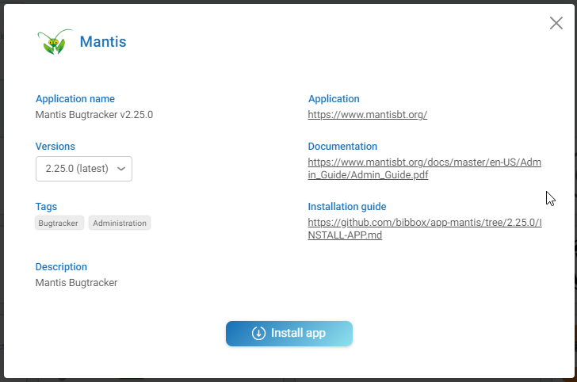
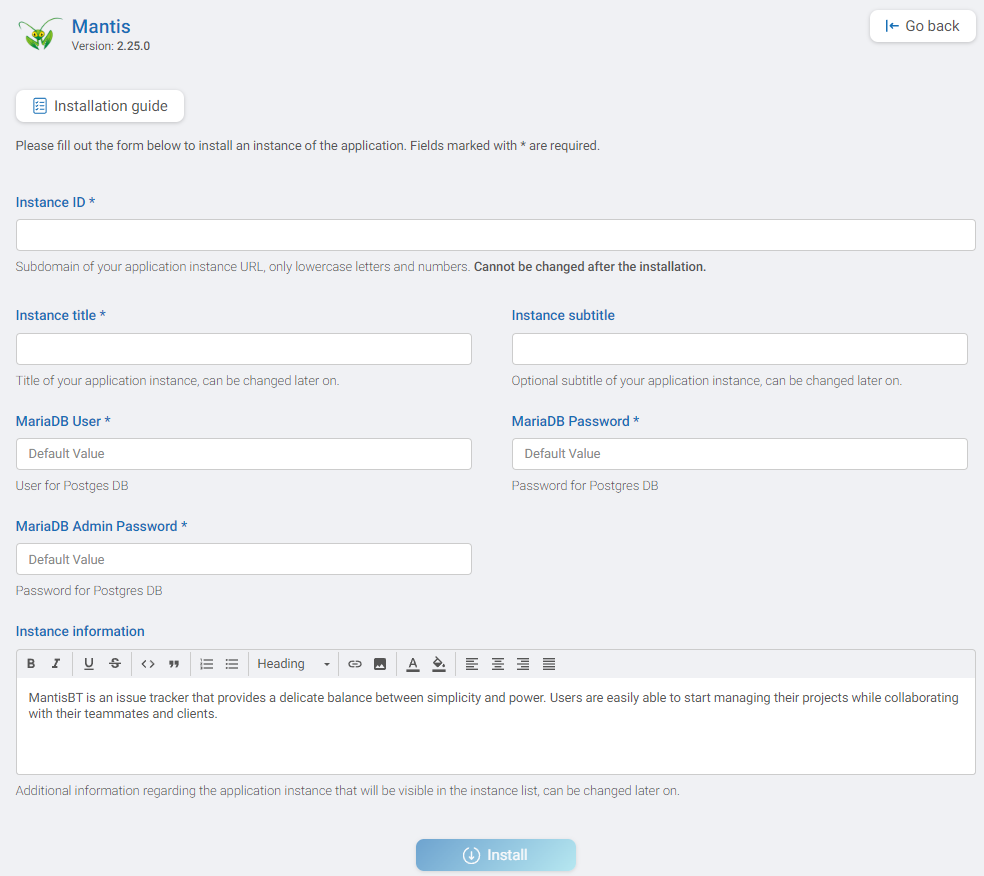
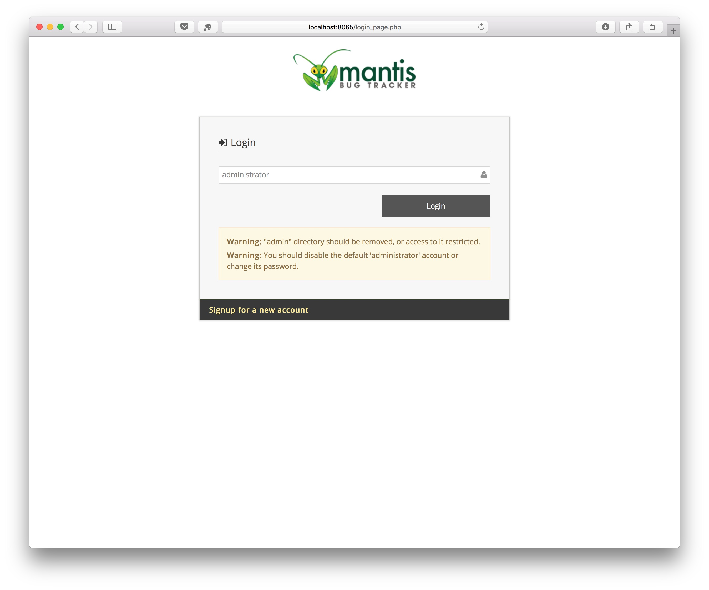

## MANTIS Installation Instructions 

The application can be installed either within the BIBBOX environment or as a stand-alone solution. Installation instructions can be found within the BIBBOX, followed by setup instructions required once the application has been successfully installed.

## Installation within in the BIBBOX

Once you've selected the desired App for your BIBBOX instance, you can choose from the available versions, as shown in the following figure.

Clicking "Install App" will open a new window, as illustrated in the following figure. Here, you can define the necessary entries. Some fields come pre-filled with suggested options, and if left unchanged, these default values will be used as the entries.

After confirming by clicking "Install," the App will be installed as a BIBBOX instance. Once the installation is complete, you only need to follow a few steps to use the App for the first time, which are described below.

## Setup after BIBBOX or stand-alone installation

* As soon as Mantis has been installed within the BIBBOX, you can launch it from the Applications menu.

* A new Tab will open in your browser and show the Mantis installer. You have to specify to following parameters:

    * Hostname (for DB Severs): **mantis-db**
    * Username (for Database): **mantis**
    * Password for Database): _as specified in installation_ (default changethispasswordinproductionenvironments)
    * Username (for Database): **bugtracker**
    * Admin Username (to create Database, if required): **root**
    * Admin Password (to create Database, if required): _as specified in installation_ (default changethisrootpasswordinproductionenvironments)

Klick on **Install/Upgrade Database**.

* Now everthing should be "GREEN" and you can continue by clicking on **Continue**

* You can login with 

   * Username: **administrator**
   * Password: **root**
 

* First you have to chnage the administrator password

* And now you can start working

## Backup instructions

* Backup the database App directory, replace APPID with the id (subdomain) of the installed app. 

        /opt/bibbox/application-instance/APPID-app-mantis
                
* Backup the mysql database with the command
       
       docker exec  APPID-seeddms-db /usr/bin/mysqldump -u root --password='YOURROOTPASSWORD' bugtracker > /home/vmadmin/mantisbackup.sql

   if you forgot the database root password, you can lookup it in the docker-compose file. 
   
        /opt/bibbox/application-instance/APPID-app-mantis/docker-compose.yml

## After the installation

Have a nice ride with the new Admins youngtimer.

