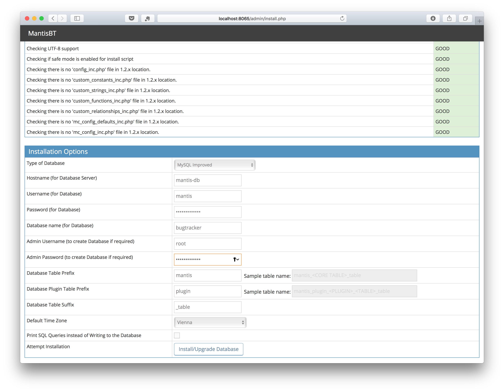
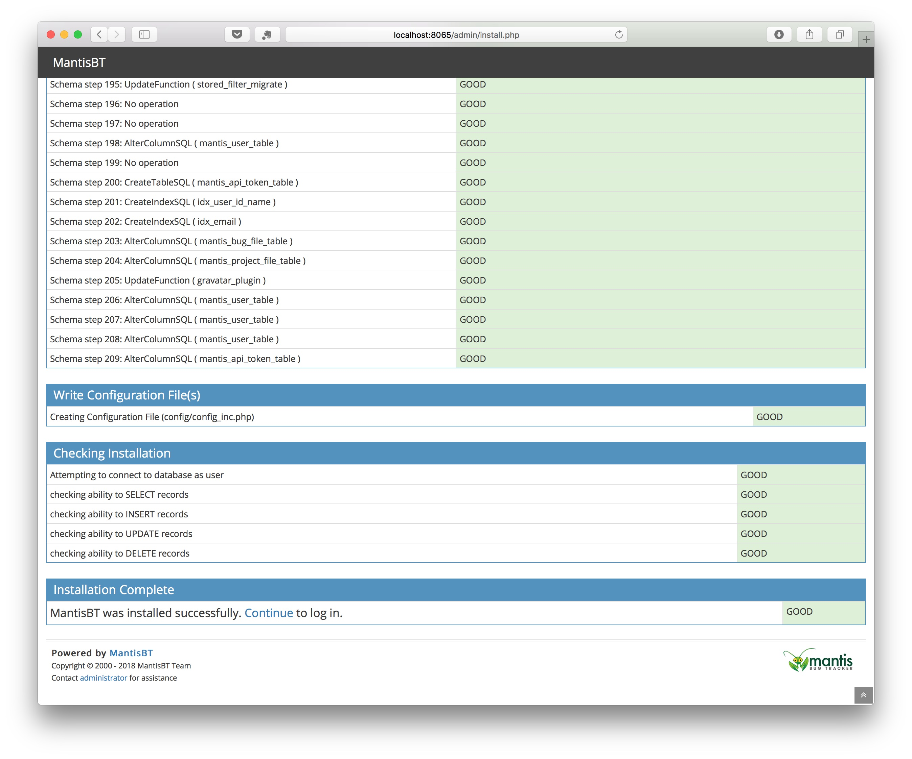
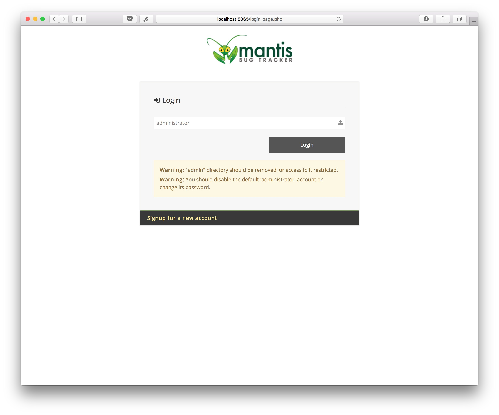
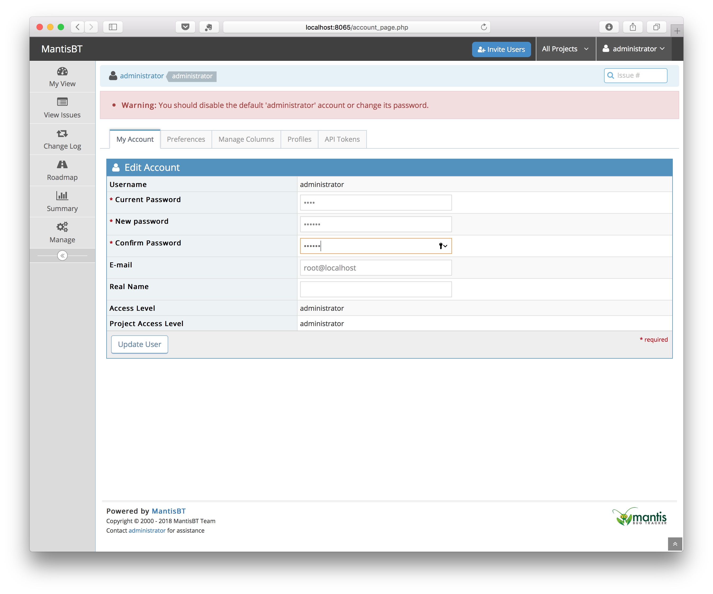
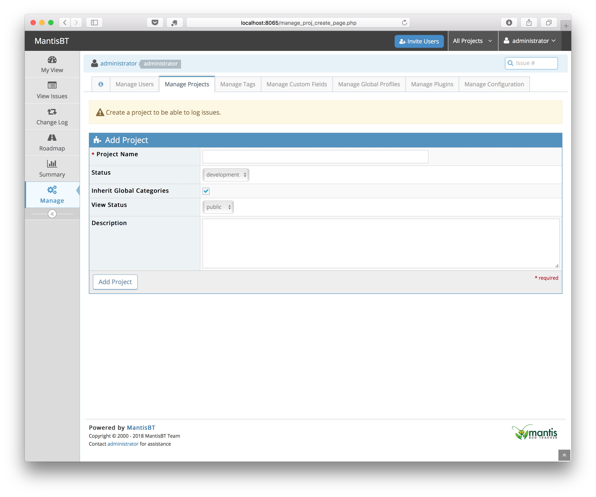

## MANTIS Installation Instructions 

* As soon as Mantis has been installed within the BIBBOX, you can launch it from the Applications menu.

* A new Tab will open in your browser and show the Mantis installer. You have to specify to following parameters:

    * Hostname (for DB Severs): **mantis-db**
    * Username (for Database): **mantis**
    * Password for Database): _as specified in installation_ (default mantis4bibbox)
    * Username (for Database): **bugtracker**
    * Admin Username (to create Database, if required): **root**
    * Admin Password (to create Database, if required): _as specified in installation_ (default mantis4bibbox)

Klick on **Install/Upgrade Database**.

* Now everthing should be "GREEN" and you can continue by clicking on **Continue**

* You can login with 

   * Username: **administrator**
   * Password: **root**
 

* First you have to chnage the administrator password

* And now you can start working

## Backup instructions

* Backup the database App directory, replace APPID with the id (subdomain) of the installed app. 

        /opt/bibbox/application-instance/APPID-app-mantis
                
* Backup the mysql database with the command
       
       docker exec  APPID-seeddms-db /usr/bin/mysqldump -u root --password='YOURROOTPASSWORD' bugtracker > /home/vmadmin/mantisbackup.sql

   if you forgot the database root password, you can lookup it in the docker-compose file. 
   
        /opt/bibbox/application-instance/APPID-app-mantis/docker-compose.yml

## After the installation

Have a nice ride with the new Admins youngtimer.

